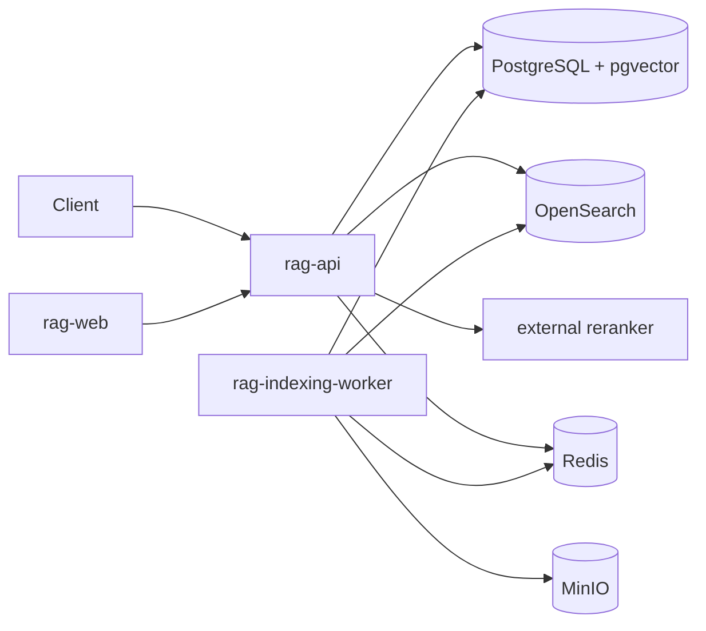

# Architecture

Ingestion commits the version, status, and outbox event atomically. A dispatcher delivers the
idempotent indexing job. The worker extracts and normalizes text, creates deterministic chunks,
embeds them in batches, writes PostgreSQL first (with owner metadata on every chunk), then
updates OpenSearch (including the owner field) and status.

Retrieval applies tenant, project, collection, and owner predicates before client metadata filters,
performs vector and BM25 searches (both owner-scoped), normalizes and fuses ranks with RRF, removes
duplicates, optionally calls the external reranker (which receives only owner-scoped candidates),
selects parent context, and persists the trace. OpenSearch failure selects vector-only mode; reranker
failure returns fusion results; only loss of vector search produces 503.

PostgreSQL commits chunks and embeddings before OpenSearch indexing. Until BM25 indexing succeeds,
the document remains `partially_indexed` but is available to the PostgreSQL retrieval path.
OpenSearch uses a strict shared mapping and every index and search operation carries exact tenant,
project, and collection fields. It is rebuildable from PostgreSQL and never authoritative.

The API never loads the embedding model. Retrieval sends the normalized query to the Celery
`search` queue, where the already loaded worker model returns a normalized vector. The API then
executes tenant-scoped cosine ordering in pgvector. Loss of the query embedding worker makes vector
search impossible and returns 503; loss of OpenSearch only disables BM25.

The default BGE-M3 profile uses `vector(1024)` so PostgreSQL can build its HNSW cosine index. Every
worker process detects the loaded model dimension and compares it with this database contract before
accepting work. A periodic Redis heartbeat exposes model name, dimension and device to readiness
without loading the model in `rag-api`.
