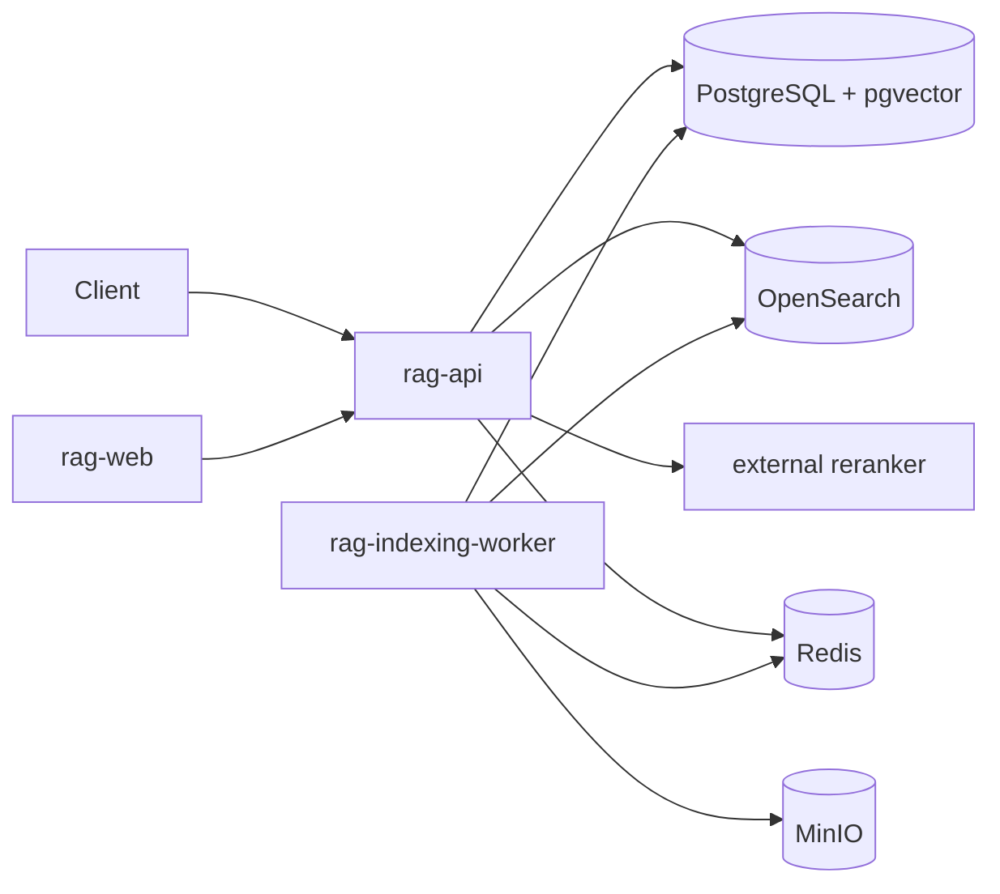

# Architecture

Ingestion commits the version, status, and outbox event atomically. A dispatcher delivers the
idempotent indexing job. The worker extracts and normalizes text, creates deterministic chunks,
embeds them in batches, writes PostgreSQL first, then updates OpenSearch and status.

Retrieval applies tenant/project/collection predicates before client metadata filters, performs
vector and BM25 searches, normalizes and fuses ranks with RRF, removes duplicates, optionally calls
the external reranker, selects parent context, and persists the trace. OpenSearch failure selects
vector-only mode; reranker failure returns fusion results; only loss of vector search produces 503.

PostgreSQL commits chunks and embeddings before OpenSearch indexing. Until BM25 indexing succeeds,
the document remains `partially_indexed` but is available to the PostgreSQL retrieval path.
OpenSearch uses a strict shared mapping and every index and search operation carries exact tenant,
project, and collection fields. It is rebuildable from PostgreSQL and never authoritative.
